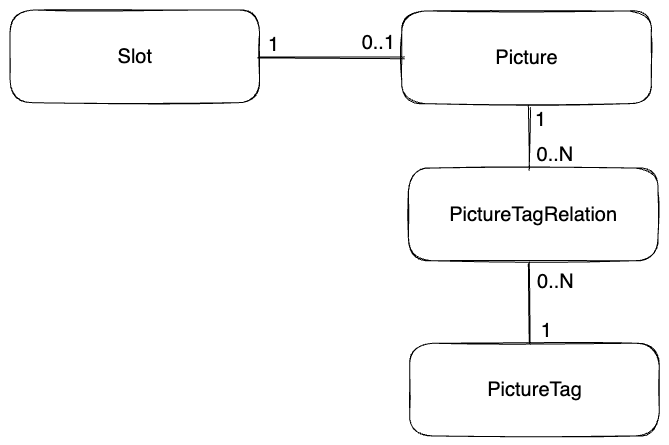

사이드 프로젝트에서 MySQL을 사용하고 있다. PostgreSQL을 주로 사용해서 당연히 안 될 거라 생각한 GROUP BY 쿼리가 있었다. 그런데 MySQL에서는 정상 동작했다. 이 차이를 정리한다.

---

## 예제

### 테이블 구조



Slot이 pictureId를 nullable하게 가지고 있다. PictureTagRelation이 pictureId와 pictureTagId를 가지고 있는 구조다.

### 쿼리

앨범의 모든 Slot을 조회한다. Slot에 Picture가 있으면 Picture 데이터를 가져온다. 이때 PictureTagRelation과 PictureTag를 조인해서 유효한 태그 이름들을 뽑아온다.

```sql
select s1_0.id,
       s1_0.layout,
       s1_0.location,
       s1_0.page,
       p1_0.id,
       p1_0.path,
       p1_0.content,
       p1_0.pictured_at,
       group_concat(p3_0.name)
from slot s1_0
         left join
     picture p1_0
     on s1_0.picture_id = p1_0.id
         left join
     picture_tag_relation p2_0
     on p2_0.picture_id = p1_0.id
         and p2_0.deleted_at is null
         left join
     picture_tag p3_0
     on p2_0.tag_id = p3_0.id
         and p3_0.deleted_at is null
where s1_0.album_id = 1
  and s1_0.deleted_at is null
group by s1_0.id
order by s1_0.page
```

이 쿼리는 정상 동작할까?

---

## PostgreSQL

PostgreSQL에서 위 쿼리를 실행하면 에러가 발생한다.

```
ERROR: column "p1_0.id" must appear in the GROUP BY clause or be used in an aggregate function
```

SELECT 컬럼이 GROUP BY 절에 포함되거나 집계함수를 통해 포함되어야 한다. 그렇지 않아서 발생하는 에러다.

### 왜 s1_0.layout은 에러가 발생하지 않았을까?

[PostgreSQL 문서](https://www.postgresql.org/docs/current/sql-select.html#SQL-GROUPBY)에서는 이렇게 안내한다.

> it is not valid for the SELECT list expressions to refer to ungrouped columns except within aggregate functions or when the ungrouped column is functionally dependent on the grouped columns

SELECT 절에는 집계 함수를 사용하거나 GROUP BY에 포함된 컬럼만 사용할 수 있다. 단, GROUP BY 컬럼에 함수적 종속인 컬럼은 예외다. 그룹화되지 않은 컬럼은 여러 값을 반환할 수 있기 때문이다.

### 함수적 종속이란?

테이블 R에 존재하는 필드들의 부분집합을 각각 X와 Y라고 하자. X의 한 값이 Y에 속한 오직 하나의 값에만 사상될 경우 "Y는 X에 함수 종속"이라고 한다.

slot.id는 PK다. slot 테이블의 모든 컬럼은 slot.id에 함수적 종속이다. 그래서 slot 테이블 조회에는 문제가 없다.

### PostgreSQL은 함수적 종속성을 어디까지 판별할까?

PostgreSQL은 GROUP BY에 [PK가 포함될 때만 함수적 종속성을 인지](https://www.postgresql.org/docs/16/sql-select.html#id-1.9.3.172.10.11)한다.

> PostgreSQL recognizes functional dependency (allowing columns to be omitted from GROUP BY) only when a table's primary key is included in the GROUP BY list.

---

## PostgreSQL에서 해결하기

### 1. GROUP BY 절에 p1_0.id 추가

PK를 기준으로 함수적 종속성을 판별하기 때문에 picture의 PK인 p1_0.id를 GROUP BY 절에 추가하면 된다.

```sql
select s1_0.id,
       s1_0.layout,
       s1_0.location,
       s1_0.page,
       p1_0.id,
       p1_0.path,
       p1_0.content,
       p1_0.pictured_at,
       string_agg(p3_0.name, ',')
from slot s1_0
         left join
     picture p1_0
     on s1_0.picture_id = p1_0.id
         left join
     picture_tag_relation p2_0
     on p2_0.picture_id = p1_0.id
         and p2_0.deleted_at is null
         left join
     picture_tag p3_0
     on p2_0.tag_id = p3_0.id
         and p3_0.deleted_at is null
where s1_0.album_id = 1
  and s1_0.deleted_at is null
group by s1_0.id, p1_0.id
order by s1_0.page;
```

### 2. 쿼리 분리 후 애플리케이션에서 합치기

slot 조회 쿼리와 사진 상세 정보 조회 쿼리를 분리한다. 애플리케이션 로직에서 결과를 합친다.

```sql
select
    s1_0.id,
    s1_0.album_id,
    s1_0.created_at,
    s1_0.deleted_at,
    s1_0.layout,
    s1_0.location,
    s1_0.page,
    s1_0.picture_id,
    s1_0.updated_at
from
    slot s1_0
where
    s1_0.album_id=?
    and s1_0.deleted_at is null
order by
    s1_0.page
```

```sql
select
    p1_0.id,
    p1_0.content,
    p1_0.path,
    p1_0.pictured_at,
    group_concat(p3_0.name)
from
    picture p1_0
left join
    picture_tag_relation p2_0
        on p1_0.id=p2_0.picture_id
        and p2_0.deleted_at is null
left join
    picture_tag p3_0
        on p2_0.tag_id=p3_0.id
        and p3_0.deleted_at is null
where
    p1_0.id in (?,?,?)
    and p1_0.deleted_at is null
group by
    p1_0.id
```

### 3. DISTINCT ON과 서브쿼리 활용

[DISTINCT ON](https://www.postgresql.org/docs/current/sql-select.html#SQL-DISTINCT)과 서브쿼리를 사용해 해결할 수 있다. DISTINCT ON은 MySQL 5.7.5 이전 ONLY_FULL_GROUP_BY가 꺼져있을 때 사용하던 GROUP BY와 유사하게 동작한다.

```sql
select distinct on(slot.id, slot.page)
       slot.id,
       slot.layout,
       slot.location,
       slot.page,
       slot.picture_id,
       pictureAlias.path,
       pictureAlias.content,
       pictureAlias.pictured_at,
       pictureAlias.tags
from slot
         left join (select picture.id,
                           picture.path,
                           picture.content,
                           picture.pictured_at,
                           string_agg(pictureTag.name,',') as tags
                    from picture
                             left join picture_tag_relation pictureTagRelation
                                       on picture.id = pictureTagRelation.picture_id and
                                          pictureTagRelation.deleted_at is null
                             left join picture_tag pictureTag
                                       on pictureTagRelation.tag_id = pictureTag.id and pictureTag.deleted_at is null
                    where picture.deleted_at is null
                    group by picture.id) as pictureAlias on slot.picture_id = pictureAlias.id
where slot.album_id = 1
  and slot.deleted_at is null
order by slot.page asc;
```

---

## MySQL

MySQL에서 첫 쿼리를 실행하면 정상 동작한다.

MySQL 5.7.5 버전 이후부터 ONLY_FULL_GROUP_BY sql mode가 기본 활성화되어 있다. 이 옵션이 켜져 있으면 함수적 종속을 탐지한다. 집계함수를 사용하지 않아도 함수적 종속이 탐지되는 항목은 조회할 수 있다.

ONLY_FULL_GROUP_BY 옵션이 꺼져있으면 함수적 종속을 판단하지 않는다. 값이 여러 개가 되어도 첫 번째 값이 반환된다.

예시 쿼리에 적용하면 다음과 같은 이유로 함수적 종속이 탐지되어 조회가 가능하다. tagName은 집계함수를 사용하고 있어서 정상 수행된다.

- `{slot.id}` → `{slot.*}`
- `{slot.picture_id}` → `{picture.id}` → `{picture.*}`

---

## 결론

같은 쿼리라도 함수적 종속성 판별 범위에 따라 결과가 달라질 수 있다. PostgreSQL은 GROUP BY에 PK가 포함될 때만 함수적 종속성을 판별한다. MySQL은 join, unique not null 등 더 넓은 범위에서 함수적 종속성을 판단한다.

---

## 참고

- [MySQL GROUP BY](https://dev.mysql.com/doc/refman/8.0/en/group-by-handling.html)
- [PostgreSQL GROUP BY](https://www.postgresql.org/docs/current/sql-select.html#SQL-GROUPBY)
- [PostgreSQL DISTINCT ON](https://www.postgresql.org/docs/current/sql-select.html#SQL-DISTINCT)
- [PostgreSQL Functional Dependency](https://wiki.postgresql.org/wiki/Functional_Dependency)
